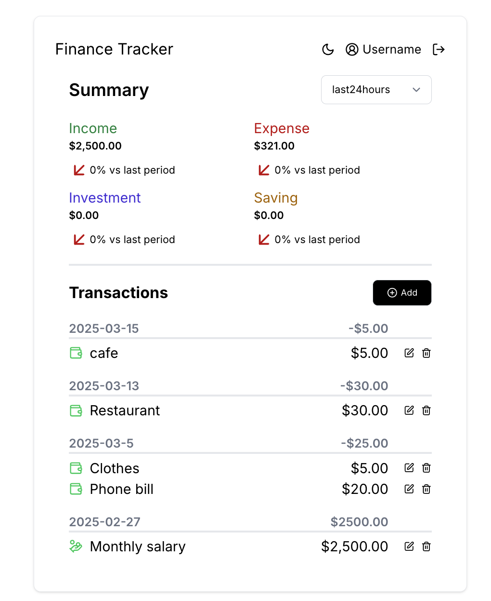

  

    <h1>&nbsp;&nbsp;Finance Tracker</h1>
  

  </ hr>
  

    
  

## Overview

This is a finance tracking app that help you to effortlessly monitor your spending.
Log in via email, view your transaction history across multiple time periods, save your personal preferences—display name, and default date range, so the dashboard always feels like yours.  
Built with TypeScript, Next.js, Tailwind CSS, and Supabase (PostgreSQL).

## Demo

Here is a working live demo : [https://finance-tracker-app-2025.vercel.app/](https://finance-tracker-app-2025.vercel.app/)

## Tech Stack

TypeScript, React, Next.js 15 (App Router), Supabase (PostgreSQL + Magic-Link Auth), and Tailwind CSS

## Features

- **Magic-Link Authentication**  
  Enter your email, receive a link, click it, and you will be redirected to the page. no password required.

- **Transaction Dashboard**  
  Filter transactions by some date ranges such as “Last 7 Days,” “Last 30 Days,” or etc”  
  If no filter is in the URL, the user’s saved default date range applies.

- **Responsive Design**  
  • Mobile: single-column layout

## Tech Stack

- TypeScript
- React
- Next.js 15 (App Router)
- Supabase (PostgreSQL + Magic-Link Auth)
- Tailwind CSS
